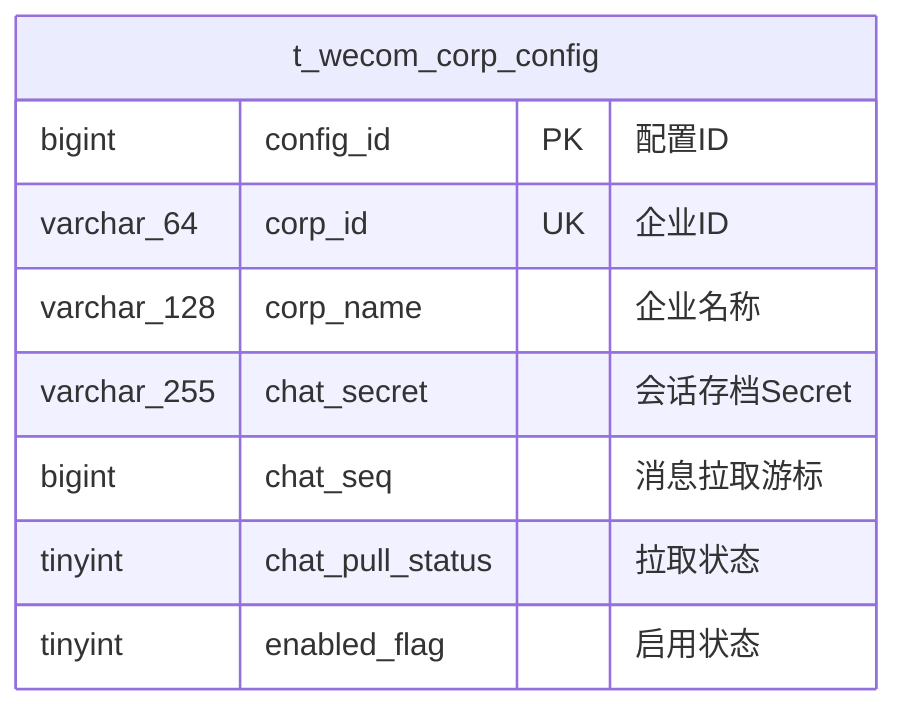
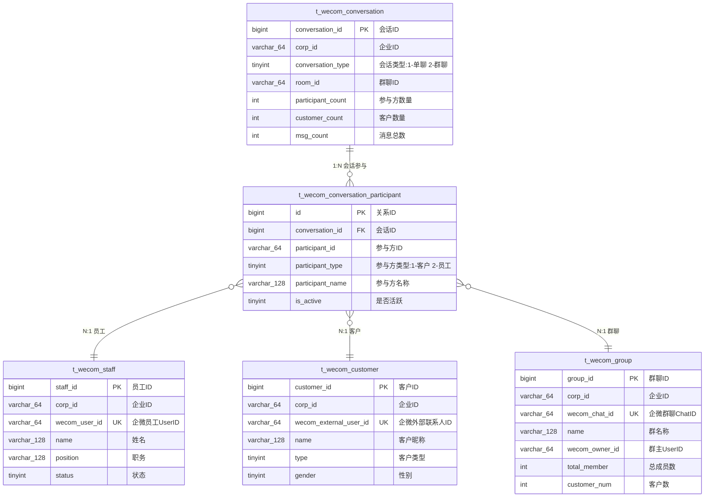
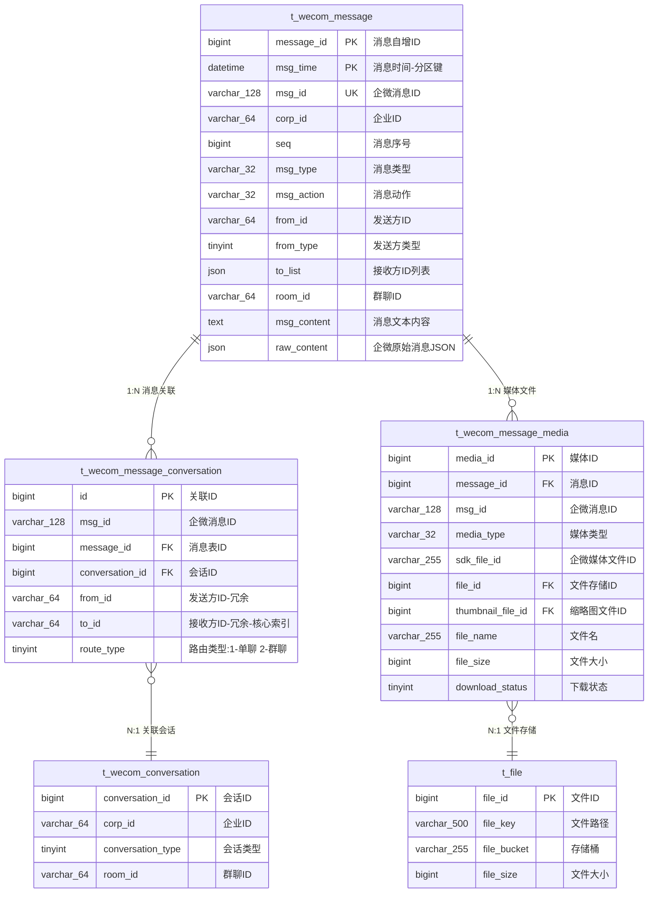
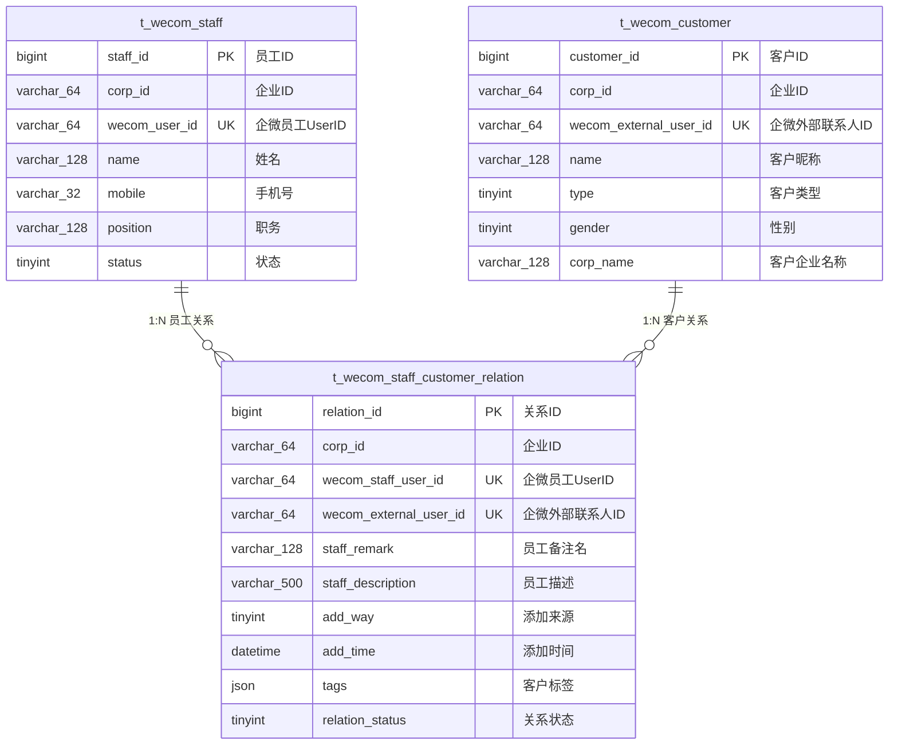
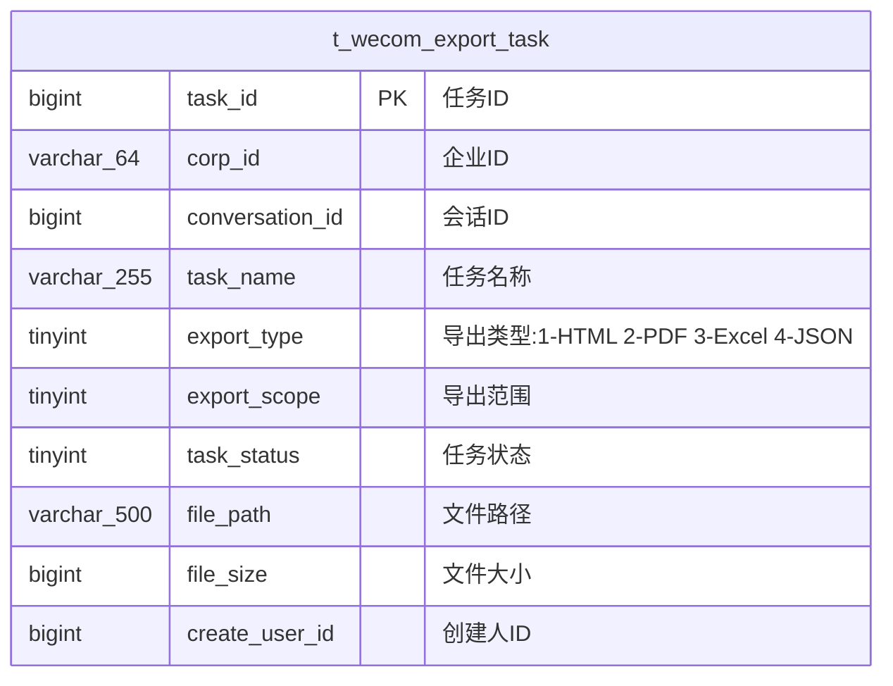

# 企业微信会话存档数据库设计

---

## 📋 目录

1. [设计概述](#设计概述)
2. [核心数据模型](#核心数据模型)
3. [表结构设计](#表结构设计)
4. [消息类型设计](#消息类型设计)
5. [索引策略](#索引策略)
6. [查询优化](#查询优化)
7. [与SmartAdmin集成](#与smartadmin集成)

---

## 设计概述

### 功能目标

实现企业微信会话存档的完整展示功能，支持:
- ✅ 会话消息的拉取、解密、存储
- ✅ 多种消息类型展示(文本/图片/语音/视频/文件等20+种)
- ✅ 单聊/群聊会话管理
- ✅ 员工/客户参与方信息管理
- ✅ 媒体文件下载和存储
- ✅ 会话搜索和筛选
- ✅ 消息导出功能

### 技术架构

**基础框架**: SmartAdmin Java17 + SpringBoot3 + MyBatis-Plus + MySQL 8.0

**核心依赖**:
- WxJava SDK (企业微信API)
- wx-finance HTTP服务 (会话存档SDK封装)
- 本地文件存储 + 可选云存储

**数据库特性**:
- MySQL 8.0 分区表(按月分区消息表)
- JSON字段存储复杂数据
- 全文索引支持消息搜索

---

## 核心数据模型

### 数据流程

```
企业微信 → wx-finance API → 后端服务 → 数据库
   ↓           ↓                 ↓           ↓
加密消息    解密服务         业务处理      持久化存储
```

### ER关系图

**渲染说明**：
- 使用 Kroki + Mermaid 渲染（Wiki.js 2.4+ 支持）
- 代码块第一行为 `kroki`，第二行为图表类型 `mermaid`
- GitHub/GitLab 等平台查看源码时需使用标准 Mermaid 代码块

#### 模块1：企业配置



#### 模块2：会话与参与方



#### 模块3：消息与关联 ⭐⭐⭐核心



**核心设计说明**：
- ✅ **消息解耦**: 消息表不存储 conversation_id，通过关联表实现多对多
- ✅ **灵活关联**: 一条消息可关联多个会话（群发场景）
- ✅ **查询优化**: to_id 冗余字段 + idx_to_time 索引 = 极速查询
- ✅ **数据流转**: 单聊1条关联、群聊1条关联、群发N条关联

#### 模块4：员工-客户关系



**设计说明**：
- ✅ **N:N关系**: 一个客户可被多个员工添加
- ✅ **员工级数据**: 每个员工对同一客户有独立的备注、标签
- ✅ **企业级共享**: 客户基础信息存储在客户表，企业级共享

#### 模块5：辅助功能



**功能说明**: 支持导出格式 HTML/PDF/Excel/JSON

---

### 核心设计亮点

- ✅ **消息会话解耦** ⭐⭐⭐：消息表不直接关联会话，通过关联表实现多对多
- ✅ **消息会话关联表** `t_wecom_message_conversation`：空间换时间，极速查询，支持群发
- ✅ **参与方关系表** `t_wecom_conversation_participant`：统一处理单聊和群聊的成员关系
- ✅ **员工-客户关系表** `t_wecom_staff_customer_relation`：支持一对多关系
- ✅ **媒体文件双表设计**：业务表 + 存储表，职责分离
- ✅ **消息表分区**：按月分区，支持海量数据高效查询

### 两张关联表的职责区别

| 表 | 职责 | 数据特点 | 典型用途 |
|----|------|---------|---------|
| **t_wecom_conversation_participant**<br>(会话参与方表) | 会话的**长期成员关系** | • 记录谁在会话里<br>• 可能没发过消息<br>• 记录入群/退群时间 | • 展示会话成员列表<br>• 判断某人是否在会话中<br>• 统计会话成员数 |
| **t_wecom_message_conversation**<br>(消息会话关联表) | 消息的**即时路由关系** | • 每条消息都有路由<br>• 支持群发<br>• 记录消息归属 | • 查询某人的消息<br>• 查询某会话的消息<br>• 统计消息数量 |

**举例说明**：
```
场景：群聊有10个人，但只有3个人发过消息

参与方表(t_wecom_conversation_participant)：
- 10条记录（所有成员）
- 用于显示"群成员列表"

消息会话关联表(t_wecom_message_conversation)：
- 只有3个人的消息路由记录
- 用于查询"谁在这个群里发过消息"
```

---

## 表结构设计

### 1. 配置管理表

#### t_wecom_corp_config (企业微信配置表)

**用途**: 存储企业微信接入配置和拉取状态

| 字段 | 类型 | 说明 | 备注 |
|------|------|------|------|
| config_id | bigint | 配置ID | 主键,自增 |
| corp_id | varchar(64) | 企业ID | 唯一索引 |
| corp_name | varchar(128) | 企业名称 | |
| agent_secret | varchar(255) | 应用Secret | 加密存储 |
| chat_secret | varchar(255) | 会话存档Secret | 加密存储 |
| chat_public_key_ver | int | RSA公钥版本 | 默认1 |
| chat_seq | bigint | 消息拉取游标 | 断点续传 |
| chat_pull_status | tinyint | 拉取状态 | 0-未开始 1-拉取中 2-异常 3-已完成 |
| last_pull_time | datetime | 最后拉取时间 | |
| last_error_msg | varchar(500) | 最后错误信息 | 异常时记录 |
| enabled_flag | tinyint | 启用状态 | 0-禁用 1-启用 |
| deleted_flag | tinyint | 删除标识 | 0-未删除 1-已删除 |
| create_user_id | bigint | 创建人ID | |
| create_time | datetime | 创建时间 | |
| update_user_id | bigint | 更新人ID | |
| update_time | datetime | 更新时间 | |

**索引**:
- PRIMARY KEY: `config_id`
- UNIQUE KEY: `uk_corp_id` (corp_id)

**说明**:
- `chat_seq`: 用于记录当前拉取到的消息序号,实现断点续传
- `chat_pull_status`: 监控拉取状态,异常时可告警
- 敏感字段(`agent_secret`, `chat_secret`)建议加密存储

---

### 2. 会话管理表

#### t_wecom_conversation (会话主表)

**用途**: 存储会话元信息,用于会话列表展示

**设计理念**: 采用关系表设计,统一处理单聊和群聊,通过 `t_wecom_conversation_participant` 关联参与方

| 字段 | 类型 | 说明 | 备注 |
|------|------|------|------|
| conversation_id | bigint | 会话ID | 主键,自增 |
| corp_id | varchar(64) | 企业ID | |
| conversation_type | tinyint | 会话类型 | 1-单聊 2-群聊 |
| room_id | varchar(64) | 群聊ID | 群聊时有值,单聊为NULL |
| room_name | varchar(128) | 群名称 | 群聊时有值 |
| participant_count | int | 参与方数量 | 单聊=2, 群聊=N (冗余字段,提升查询性能) |
| customer_count | int | 客户数量 | 用于快速判断内部/外部会话 (冗余字段) |
| last_msg_id | varchar(128) | 最后一条消息ID | |
| last_msg_type | varchar(32) | 最后消息类型 | |
| last_msg_content | text | 最后消息内容预览 | 列表展示用 |
| last_msg_time | datetime | 最后消息时间 | 用于排序 |
| last_msg_sender_id | varchar(64) | 最后消息发送者ID | 冗余字段,列表展示"XXX: 消息内容" |
| last_msg_sender_name | varchar(128) | 最后消息发送者名称 | |
| msg_count | int | 消息总数 | |
| deleted_flag | tinyint | 删除标识 | |
| create_time | datetime | 创建时间 | |
| update_time | datetime | 更新时间 | |

**索引**:
- PRIMARY KEY: `conversation_id`
- UNIQUE KEY: `uk_room` (corp_id, room_id) - 群聊唯一性
- KEY: `idx_corp_type` (corp_id, conversation_type)
- KEY: `idx_last_msg_time` (last_msg_time)
- KEY: `idx_customer_count` (customer_count) - 快速筛选外部/内部会话

**说明**:
- 单聊会话的唯一性通过参与方关系表保证(见下方)
- `participant_count` 和 `customer_count` 是冗余字段,避免JOIN查询
- 群聊通过 `room_id` 唯一标识

---

#### t_wecom_conversation_participant (会话参与方关系表)

**用途**: 存储会话与参与方的多对多关系,统一处理单聊和群聊

| 字段 | 类型 | 说明 | 备注 |
|------|------|------|------|
| id | bigint | 关系ID | 主键,自增 |
| conversation_id | bigint | 会话ID | 外键关联 |
| participant_id | varchar(64) | 参与方ID | 员工UserID或客户ExternalUserID |
| participant_type | tinyint | 参与方类型 | 1-客户 2-员工 |
| participant_name | varchar(128) | 参与方名称 | 冗余字段,避免JOIN |
| relation_start_time | datetime | 关系开始时间 | 群聊=入群时间, 单聊=加好友时间 |
| relation_end_time | datetime | 关系结束时间 | 群聊=退群时间, 单聊=删好友时间, NULL表示关系仍存在 |
| is_active | tinyint | 是否活跃 | 1-关系存在 0-关系已结束 |
| deleted_flag | tinyint | 删除标识 | |
| create_time | datetime | 创建时间 | |
| update_time | datetime | 更新时间 | |

**索引**:
- PRIMARY KEY: `id`
- UNIQUE KEY: `uk_conv_participant` (conversation_id, participant_id)
- KEY: `idx_participant` (participant_id, conversation_id) - 核心查询索引
- KEY: `idx_conv_type` (conversation_id, participant_type)

**设计说明**:

1. **单聊场景** (2条记录):
   ```
   会话1: 销售A ↔ 客户B
   ├─ 记录1: conversation_id=1, participant_id=A, participant_type=2
   └─ 记录2: conversation_id=1, participant_id=B, participant_type=1
   ```

2. **群聊场景** (N条记录):
   ```
   会话2: 群聊(A, B, C, D)
   ├─ 记录1: conversation_id=2, participant_id=A, is_active=1
   ├─ 记录2: conversation_id=2, participant_id=B, is_active=1
   ├─ 记录3: conversation_id=2, participant_id=C, is_active=0, leave_time=xxx
   └─ 记录4: conversation_id=2, participant_id=D, is_active=1
   ```

3. **单聊唯一性保证** (应用层逻辑):
   ```java
   // 创建单聊会话前,先查询是否已存在
   List<Long> conversationIds = participantDao.findConversationsByParticipants(
       Arrays.asList(userId1, userId2)
   );

   // SQL: 查询包含这两个参与方的单聊会话
   SELECT conversation_id
   FROM t_wecom_conversation_participant
   WHERE participant_id IN (?, ?)
   GROUP BY conversation_id
   HAVING COUNT(DISTINCT participant_id) = 2
     AND conversation_id IN (
       SELECT conversation_id FROM t_wecom_conversation
       WHERE conversation_type = 1
     );
   ```

---

**会话类型判断逻辑**:

```
单聊:
- conversation_type = 1
- room_id = NULL
- participant_count = 2
- customer_count 判断内部/外部:
  * 内部单聊: customer_count = 0 (员工↔员工)
  * 外部单聊: customer_count = 1 (员工↔客户)

群聊:
- conversation_type = 2
- room_id 不为空
- participant_count >= 2
- customer_count 判断内部/外部:
  * 内部群: customer_count = 0
  * 客户群: customer_count > 0
```

---

**核心查询场景**:

```sql
-- 场景1: 查询某销售的所有会话列表(单聊+群聊)
-- ✅ 优化: 利用 idx_participant 索引,避免全表扫描
SELECT c.*
FROM t_wecom_conversation c
INNER JOIN t_wecom_conversation_participant p ON p.conversation_id = c.conversation_id
WHERE p.participant_id = 'sales001'
  AND c.corp_id = 'test_corp'
ORDER BY c.last_msg_time DESC
LIMIT 20;

-- 场景2: 查询销售的外部客户单聊会话
-- ✅ 优化: 利用冗余字段 customer_count,避免再次JOIN
SELECT c.*
FROM t_wecom_conversation c
INNER JOIN t_wecom_conversation_participant p ON p.conversation_id = c.conversation_id
WHERE p.participant_id = 'sales001'
  AND c.conversation_type = 1
  AND c.customer_count = 1  -- 外部单聊
ORDER BY c.last_msg_time DESC
LIMIT 20;

-- 场景3: 查询两人的会话(判断是否已存在)
-- ✅ 用于创建会话前去重
SELECT c.conversation_id, c.*
FROM t_wecom_conversation c
INNER JOIN (
  SELECT conversation_id
  FROM t_wecom_conversation_participant
  WHERE participant_id IN ('user1', 'user2')
  GROUP BY conversation_id
  HAVING COUNT(DISTINCT participant_id) = 2
) p ON p.conversation_id = c.conversation_id
WHERE c.conversation_type = 1;

-- 场景4: 查询某群聊的所有参与方
SELECT p.*
FROM t_wecom_conversation_participant p
WHERE p.conversation_id = ?
  AND p.is_active = 1  -- 仅查询在群成员
ORDER BY p.join_time ASC;

-- 场景5: 查询某客户参与的所有会话(含已退出的群)
SELECT c.*, p.is_active, p.leave_time
FROM t_wecom_conversation c
INNER JOIN t_wecom_conversation_participant p ON p.conversation_id = c.conversation_id
WHERE p.participant_id = 'customer001'
ORDER BY c.last_msg_time DESC;
```

---

**性能优化策略**:

1. **冗余字段减少JOIN**:
   - `participant_count`, `customer_count` 避免统计查询
   - `participant_name` 避免JOIN员工/客户表
   - `last_msg_sender_name` 会话列表直接显示

2. **索引覆盖高频查询**:
   - `idx_participant (participant_id, conversation_id)` - 查某人的会话
   - `uk_conv_participant` - 防止重复参与方

3. **分页查询优化**:
   ```sql
   -- 先查会话ID(覆盖索引),再JOIN查详情
   SELECT c.*
   FROM t_wecom_conversation c
   INNER JOIN (
     SELECT conversation_id
     FROM t_wecom_conversation_participant
     WHERE participant_id = ?
     LIMIT 20 OFFSET 0
   ) p ON p.conversation_id = c.conversation_id
   ORDER BY c.last_msg_time DESC;
   ```

4. **缓存策略**:
   ```java
   // 缓存某人的会话ID列表(仅ID,体积小)
   "wecom:conv:ids:{participant_id}" -> [1,2,3,4,5...] (TTL 30分钟)

   // 缓存单个会话详情
   "wecom:conv:detail:{conversation_id}" -> ConversationVO (TTL 10分钟)

   // 新消息时只更新对应会话的缓存,不清除整个列表
   ```

---

### 3. 消息管理表

#### t_wecom_message (消息主表)

**用途**: 存储纯粹的消息内容，不直接关联会话（通过关联表解耦）

**设计理念**: 消息表只存储消息本身，与会话的关系由 `t_wecom_message_conversation` 维护

| 字段 | 类型 | 说明 | 备注 |
|------|------|------|------|
| message_id | bigint | 消息自增ID | 主键 |
| msg_id | varchar(128) | 企微消息ID | 唯一标识 |
| corp_id | varchar(64) | 企业ID | |
| seq | bigint | 消息序号 | 企微SDK返回,用于排序和断点续传 |
| msg_type | varchar(32) | 消息类型 | text/image/voice/video等 |
| msg_action | varchar(32) | 消息动作 | send-发送 recall-撤回 |
| from_id | varchar(64) | 发送方ID | |
| from_type | tinyint | 发送方类型 | 1-客户 2-员工 |
| from_name | varchar(128) | 发送方名称 | 冗余字段 |
| to_list | json | 接收方ID列表 | JSON数组（企微原始数据） |
| room_id | varchar(64) | 群聊ID | 群聊时有值（企微原始数据） |
| msg_time | datetime | 消息时间 | **分区键** |
| msg_content | text | 消息文本内容 | 文本消息直接存储,其他类型提取摘要 |
| raw_content | json | 企微原始消息JSON | 完整数据,用于详情展示 |
| public_key_ver | int | 加密公钥版本 | |
| deleted_flag | tinyint | 删除标识 | |
| create_time | datetime | 创建时间 | |
| update_time | datetime | 更新时间 | |

**索引**:
- PRIMARY KEY: `(message_id, msg_time)` - 分区表复合主键
- UNIQUE KEY: `uk_msg_id` (msg_id)
- KEY: `idx_corp` (corp_id)
- KEY: `idx_seq` (seq)
- KEY: `idx_from` (from_id)
- KEY: `idx_room` (room_id)
- KEY: `idx_msg_time` (msg_time)
- KEY: `idx_msg_type` (msg_type)

**说明**:
- ❌ 不存储 `conversation_id`：与会话解耦，通过关联表建立关系
- ✅ 保留 `to_list` 和 `room_id`：企微原始数据，用于消息处理逻辑
- ✅ 一条消息可以关联多个会话：支持群发场景

**分区策略**:

```sql
-- 按月分区,提升大数据量查询性能
PARTITION BY RANGE (YEAR(msg_time) * 100 + MONTH(msg_time)) (
  PARTITION p202501 VALUES LESS THAN (202502),
  PARTITION p202502 VALUES LESS THAN (202503),
  ...
  PARTITION pmax VALUES LESS THAN MAXVALUE
);
```

**raw_content JSON结构示例**:

```json
// 文本消息
{
  "msgid": "CAQQluDa4QUY0On2rYSAgAMgzPrShAE=",
  "action": "send",
  "from": "UserID123",
  "tolist": ["UserID456"],
  "roomid": "",
  "msgtime": 1547087894783,
  "msgtype": "text",
  "text": {
    "content": "消息内容"
  }
}

// 图片消息
{
  "msgtype": "image",
  "image": {
    "sdkfileid": "CtYBMzA5NDcwMjAxNDAzMjMz...",
    "md5sum": "50de8e5ae8ffe4f1df7a93841f71993a",
    "filesize": 70961
  }
}

// 文件消息
{
  "msgtype": "file",
  "file": {
    "filename": "项目文档.pdf",
    "fileext": "pdf",
    "sdkfileid": "CtYBMzA5NDcwMjAxNDAzMjMz...",
    "md5sum": "e5b6d8e3f2a9c7d1b4e8f9a1c2d3e4f5",
    "filesize": 2048576
  }
}
```

**查询优化**:

```sql
-- ✅ 利用分区 - 必须带时间条件
SELECT * FROM t_wecom_message
WHERE conversation_id = ?
  AND msg_time >= DATE_SUB(NOW(), INTERVAL 7 DAY)  -- 利用分区
ORDER BY seq ASC
LIMIT 50;

-- ❌ 不利用分区 - 会扫描所有分区
SELECT * FROM t_wecom_message
WHERE conversation_id = ?
ORDER BY seq ASC
LIMIT 50;
```

---

#### t_wecom_message_conversation (消息会话关联表) ⭐⭐⭐核心

**用途**: 消息与会话的多对多关联表，实现消息会话解耦，采用空间换时间策略优化查询性能

**设计理念**:
- **职责清晰**：消息表只存消息，会话表只存会话，关联表建立路由关系
- **解耦灵活**：一条消息可以关联多个会话（群发场景）
- **性能优化**：通过to_id冗余字段实现单表索引查询，避免复杂JOIN
- **扩展友好**：支持消息转发、跨会话引用等未来需求

| 字段 | 类型 | 说明 | 备注 |
|------|------|------|------|
| id | bigint | 关联ID | 主键,自增 |
| msg_id | varchar(128) | 企微消息ID | 关联原始消息,方便定位 |
| message_id | bigint | 消息表ID | 关联t_wecom_message |
| conversation_id | bigint | 会话ID | 关联t_wecom_conversation |
| from_id | varchar(64) | 发送方ID | 冗余字段,加速查询 |
| to_id | varchar(64) | 接收方ID | **核心冗余字段**：单聊=UserID, 群聊=RoomID |
| route_type | tinyint | 路由类型 | 1-单聊 2-群聊 |
| deleted_flag | tinyint | 删除标识 | |
| create_time | datetime | 创建时间 | |

**索引**:
- PRIMARY KEY: `id`
- KEY: `idx_msg` (msg_id)
- KEY: `idx_message` (message_id)
- KEY: `idx_conversation` (conversation_id)
- KEY: `idx_from_to` (from_id, to_id)
- KEY: `idx_to_time` (to_id, create_time) - **🔥核心查询索引：查询某人的消息**

**数据示例**:

**场景1：群聊消息**
```sql
-- 企微原始消息
msgid=msg001, from=rocky, roomid=room123, tolist=[...]

-- 生成1条关联记录
INSERT INTO t_wecom_message_conversation VALUES (
  1, 'msg001', 1001, 10, 'rocky', 'room123', 2, 0, NOW()
);

说明:
- 群聊消息只生成1条关联记录
- to_id = room123（群聊ID）
- conversation_id = 10（查询/创建的群聊会话ID）
```

**场景2：单聊消息**
```sql
-- 企微原始消息
msgid=msg002, from=rocky, tolist=[zhangsan], roomid=""

-- 生成1条关联记录
INSERT INTO t_wecom_message_conversation VALUES (
  2, 'msg002', 1002, 20, 'rocky', 'zhangsan', 1, 0, NOW()
);

说明:
- 单聊消息生成1条关联记录
- to_id = zhangsan（接收方UserID）
- conversation_id = 20（查询/创建的单聊会话ID）
```

**场景3：群发消息（一对多）**
```sql
-- 企微原始消息
msgid=msg003, from=rocky, tolist=[zhangsan,lisi,wangwu], roomid=""

-- 生成3条关联记录（每个接收者一条）
INSERT INTO t_wecom_message_conversation VALUES
  (3, 'msg003', 1003, 20, 'rocky', 'zhangsan', 1, 0, NOW()),
  (4, 'msg003', 1003, 21, 'rocky', 'lisi', 1, 0, NOW()),
  (5, 'msg003', 1003, 22, 'rocky', 'wangwu', 1, 0, NOW());

说明:
- 群发消息生成N条关联记录（N=接收者数量）
- 每条记录对应不同的to_id和conversation_id
- 同一条消息（message_id=1003）关联到多个会话
```

**核心查询场景**:

```sql
-- 场景1: 查询某人收到的所有消息（🔥极速查询，单表索引扫描）
SELECT m.*
FROM t_wecom_message m
INNER JOIN t_wecom_message_conversation mc ON m.message_id = mc.message_id
WHERE mc.to_id = 'rocky'
  AND m.msg_time >= DATE_SUB(NOW(), INTERVAL 7 DAY)
ORDER BY m.msg_time DESC
LIMIT 50;

-- 场景2: 查询某人发送或接收的所有消息
SELECT m.*
FROM t_wecom_message m
INNER JOIN t_wecom_message_conversation mc ON m.message_id = mc.message_id
WHERE (mc.to_id = 'rocky' OR mc.from_id = 'rocky')
  AND m.msg_time >= DATE_SUB(NOW(), INTERVAL 7 DAY)
ORDER BY m.msg_time DESC
LIMIT 50;

-- 场景3: 查询某会话的所有消息（利用conversation_id索引）
SELECT m.*
FROM t_wecom_message m
INNER JOIN t_wecom_message_conversation mc ON m.message_id = mc.message_id
WHERE mc.conversation_id = ?
  AND m.msg_time >= ?  -- 利用分区
ORDER BY m.seq ASC
LIMIT 50;

-- 场景4: 统计某人的消息数量（覆盖索引，无需回表）
SELECT COUNT(*) FROM t_wecom_message_conversation
WHERE to_id = 'rocky'
  AND create_time >= DATE_SUB(NOW(), INTERVAL 30 DAY);

-- 场景5: 查找群发消息（同一条消息关联多个会话）
SELECT msg_id, COUNT(*) as conversation_count
FROM t_wecom_message_conversation
WHERE route_type = 1  -- 单聊
GROUP BY msg_id
HAVING COUNT(*) > 1;
```

**性能对比**:

| 查询方式 | 表扫描 | 索引使用 | 性能 |
|---------|-------|---------|------|
| **原方案**: JOIN参与方关系表 | 3张表 | 多表JOIN | 慢 ⚠️ |
| **新方案**: 消息会话关联表 | 2张表 | 单表索引扫描 | 快 ✅ |

**空间成本**:
- 假设: 1000万条消息，平均每条1.5个关联（群聊1个，单聊1个，群发多个）
- 关联表记录: 1500万条
- 存储空间: 约1.5GB（每条记录~100字节）
- **结论**: 成本完全可接受 ✅

**消息处理流程**:

```
接收企微消息
↓
解密消息JSON
↓
判断会话类型
├─ roomid不为空? → 群聊
│   ├─ 查询/创建会话 (根据corp_id + roomid)
│   └─ 创建1条关联记录: to_id=roomid
└─ roomid为空? → 单聊或群发
    ├─ 遍历tolist中的每个接收者
    ├─ 查询/创建会话 (根据from + to参与方组合)
    └─ 为每个接收者创建1条关联记录: to_id=接收者UserID
```

**设计优势**:
- ✅ **查询性能**: 单表索引扫描，避免复杂JOIN
- ✅ **群发支持**: 一条消息可以有多条关联记录
- ✅ **适合存档**: 读多写少，空间成本可接受
- ✅ **索引覆盖**: idx_to_time可以覆盖大部分查询
- ✅ **消息解耦**: 消息表专注于消息内容，关联关系由专门的表维护

---

#### t_wecom_message_media (会话媒体文件表)

**用途**: 存储会话消息中的媒体文件业务信息，关联消息表和文件存储表

**设计理念**: 分离存储和业务，t_file负责文件存储，本表负责业务信息和展示需求

| 字段 | 类型 | 说明 | 备注 |
|------|------|------|------|
| media_id | bigint | 媒体ID | 主键,自增 |
| message_id | bigint | 消息ID | 关联t_wecom_message |
| msg_id | varchar(128) | 企微消息ID | 冗余字段,方便查询 |
| corp_id | varchar(64) | 企业ID | |
| media_type | varchar(32) | 媒体类型 | image/voice/video/file/emotion |
| sdk_file_id | varchar(255) | 企微媒体文件ID | 企微SDK返回的文件ID,用于下载 |
| md5sum | varchar(64) | 文件MD5值 | 企微返回,用于校验 |
| file_id | bigint | 文件存储ID | 关联t_file表,存储主文件 |
| thumbnail_file_id | bigint | 缩略图文件ID | 关联t_file表,存储缩略图(图片/视频用) |
| file_name | varchar(255) | 文件名 | 从消息中提取或生成 |
| file_ext | varchar(32) | 文件扩展名 | jpg/png/mp3/mp4/pdf等 |
| file_size | bigint | 文件大小 | 字节数 |
| duration | int | 时长 | 语音/视频时长(秒) |
| width | int | 宽度 | 图片/视频宽度(像素) |
| height | int | 高度 | 图片/视频高度(像素) |
| download_status | tinyint | 下载状态 | 0-待下载 1-下载中 2-已下载 3-失败 |
| download_time | datetime | 下载时间 | 成功下载的时间 |
| download_error_msg | varchar(500) | 下载失败原因 | 失败时记录错误信息 |
| deleted_flag | tinyint | 删除标识 | |
| create_time | datetime | 创建时间 | |
| update_time | datetime | 更新时间 | |

**索引**:
- PRIMARY KEY: `media_id`
- UNIQUE KEY: `uk_msg_media` (message_id, media_type) - 一条消息一种类型只有一个媒体文件
- KEY: `idx_msg_id` (msg_id)
- KEY: `idx_sdk_file_id` (sdk_file_id)
- KEY: `idx_file_id` (file_id)
- KEY: `idx_download_status` (download_status)

**关联关系**:
```
t_wecom_message (消息表)
        ↓ 1:N
t_wecom_message_media (媒体文件表)
        ↓ N:1
t_file (SmartAdmin文件存储表)
```

**数据示例**:
```sql
-- 图片消息
INSERT INTO t_wecom_message_media VALUES (
  1, 1001, 'msgid123', 'corp001', 'image',
  'sdk_file_id_xxx', 'md5_xxx',
  5001, 5002,  -- file_id, thumbnail_file_id
  '客户发的产品图.jpg', 'jpg', 1024000,
  NULL, 1920, 1080,  -- duration, width, height
  2, '2025-10-08 10:00:00', NULL,  -- 已下载
  0, NOW(), NOW()
);

-- 语音消息
INSERT INTO t_wecom_message_media VALUES (
  2, 1002, 'msgid456', 'corp001', 'voice',
  'sdk_file_id_yyy', 'md5_yyy',
  5003, NULL,  -- file_id, 语音无缩略图
  '语音消息_20251008.amr', 'amr', 50000,
  30, NULL, NULL,  -- 30秒语音
  2, '2025-10-08 10:01:00', NULL,
  0, NOW(), NOW()
);

-- 文件消息
INSERT INTO t_wecom_message_media VALUES (
  3, 1003, 'msgid789', 'corp001', 'file',
  'sdk_file_id_zzz', 'md5_zzz',
  5004, NULL,
  '合同文件.pdf', 'pdf', 2048000,
  NULL, NULL, NULL,
  2, '2025-10-08 10:02:00', NULL,
  0, NOW(), NOW()
);
```

**媒体类型说明**:
| media_type | 说明 | 是否有缩略图 | 是否有时长 |
|-----------|------|------------|----------|
| image | 图片 | ✅ 是 | ❌ 否 |
| voice | 语音 | ❌ 否 | ✅ 是 |
| video | 视频 | ✅ 是 | ✅ 是 |
| file | 文件 | ❌ 否 | ❌ 否 |
| emotion | 表情 | ❌ 否 | ❌ 否 |

**下载状态流转**:
```
0(待下载) → 1(下载中) → 2(已下载)
                    ↘ 3(失败) → [重试] → 1(下载中)
```

**核心查询场景**:
```sql
-- 场景1: 查询消息的媒体文件信息（含文件URL）
SELECT
  m.media_id,
  m.media_type,
  m.file_name,
  m.file_size,
  m.duration,
  f1.file_key AS file_url,
  f2.file_key AS thumbnail_url
FROM t_wecom_message_media m
LEFT JOIN t_file f1 ON m.file_id = f1.file_id
LEFT JOIN t_file f2 ON m.thumbnail_file_id = f2.file_id
WHERE m.message_id = ?;

-- 场景2: 查询待下载的媒体文件
SELECT *
FROM t_wecom_message_media
WHERE download_status = 0
  AND deleted_flag = 0
ORDER BY create_time ASC
LIMIT 100;

-- 场景3: 统计媒体文件下载情况
SELECT
  media_type,
  download_status,
  COUNT(*) AS count,
  SUM(file_size) AS total_size
FROM t_wecom_message_media
WHERE corp_id = 'corp001'
  AND create_time >= DATE_SUB(NOW(), INTERVAL 7 DAY)
GROUP BY media_type, download_status;
```

**设计优势**:
- ✅ 分离关注点：存储（t_file）vs 业务（t_wecom_message_media）
- ✅ 支持缩略图：图片和视频可以有独立的缩略图文件
- ✅ 下载管理：记录下载状态，支持异步下载和失败重试
- ✅ 企微特有信息：保留sdk_file_id和md5sum，方便重新下载
- ✅ 展示优化：冗余文件名、大小、时长等，减少JOIN查询

---

### 4. 参与方信息表

#### t_wecom_staff (员工表)

**用途**: 存储企业员工信息

| 字段 | 类型 | 说明 | 备注 |
|------|------|------|------|
| staff_id | bigint | 员工ID | 主键,自增 |
| corp_id | varchar(64) | 企业ID | |
| wecom_user_id | varchar(64) | 企微员工UserID | 企微API返回的原始ID |
| name | varchar(128) | 姓名 | |
| alias | varchar(128) | 别名 | |
| mobile | varchar(32) | 手机号 | |
| position | varchar(128) | 职务 | |
| gender | tinyint | 性别 | 0-未定义 1-男 2-女 |
| avatar | varchar(500) | 头像URL | |
| department | json | 部门ID列表 | JSON数组 |
| status | tinyint | 状态 | 1-已激活 2-已禁用 4-未激活 5-已离职 |
| enable_chat_archive_flag | tinyint | 是否开启会话存档 | 0-否 1-是 |
| has_conversation_flag | tinyint | 是否有会话记录 | 0-否 1-是 |
| deleted_flag | tinyint | 删除标识 | |
| create_time | datetime | 创建时间 | |
| update_time | datetime | 更新时间 | |

**索引**:
- PRIMARY KEY: `staff_id`
- UNIQUE KEY: `uk_corp_user` (corp_id, wecom_user_id)
- KEY: `idx_name` (name)
- KEY: `idx_status` (status)

---

#### t_wecom_staff_customer_relation (员工-客户关系表) ⭐新增

**用途**: 存储员工与客户的关联关系及员工级别的数据

**设计理念**: 一个客户可以被多个员工添加，每个员工对同一客户有独立的备注、标签、添加方式等

| 字段 | 类型 | 说明 | 备注 |
|------|------|------|------|
| relation_id | bigint | 关系ID | 主键,自增 |
| corp_id | varchar(64) | 企业ID | |
| wecom_staff_user_id | varchar(64) | 企微员工UserID | 关联员工表 |
| wecom_external_user_id | varchar(64) | 企微客户ExternalUserID | 关联客户表 |
| staff_remark | varchar(128) | 员工备注名 | 员工对客户的备注 |
| staff_description | varchar(500) | 员工描述 | 员工对客户的描述 |
| add_way | tinyint | 添加来源 | 0-未知 1-扫码 2-搜手机号 3-名片分享 4-群聊 5-通讯录 6-微信联系人 7-申请 8-自动添加 9-搜邮箱 201-内部共享 202-管理员分配 |
| add_time | datetime | 添加时间 | 员工添加客户的时间 |
| state | varchar(128) | 来源渠道 | 添加客户时的渠道参数 |
| remark_corp_name | varchar(128) | 备注企业名称 | 员工备注的客户企业名 |
| remark_mobiles | json | 备注手机号 | 员工备注的客户手机号列表 |
| tags | json | 客户标签 | 员工给客户打的标签（JSON数组，包含企业标签和个人标签） |
| relation_status | tinyint | 关系状态 | 0-已删除好友 1-正常 |
| deleted_flag | tinyint | 删除标识 | |
| create_time | datetime | 创建时间 | |
| update_time | datetime | 更新时间 | |

**索引**:
- PRIMARY KEY: `relation_id`
- UNIQUE KEY: `uk_corp_staff_customer` (corp_id, wecom_staff_user_id, wecom_external_user_id)
- KEY: `idx_staff` (wecom_staff_user_id)
- KEY: `idx_customer` (wecom_external_user_id)
- KEY: `idx_relation_status` (relation_status)

**数据示例**:
```
客户"李四"被两个员工添加（不同的备注和标签）:
relation_id=1, wecom_staff_user_id=rocky, wecom_external_user_id=ext001,
  staff_remark=李部长, add_way=1,
  tags=[{"tag_name":"VIP客户","tag_id":"xxx","type":1},{"tag_name":"重点跟进","type":2}]

relation_id=2, wecom_staff_user_id=zhangsan, wecom_external_user_id=ext001,
  staff_remark=采购经理, add_way=2,
  tags=[{"tag_name":"潜在客户","type":2}]
```

**add_way 枚举值**:
| 值 | 说明 |
|----|------|
| 0 | 未知来源 |
| 1 | 扫描二维码 |
| 2 | 搜索手机号 |
| 3 | 名片分享 |
| 4 | 群聊 |
| 5 | 手机通讯录 |
| 6 | 微信联系人 |
| 7 | 来自微信的添加好友申请 |
| 8 | 安装第三方应用时自动添加的客服人员 |
| 9 | 搜索邮箱 |
| 201 | 内部成员共享 |
| 202 | 管理员/负责人分配 |

**tags JSON结构**:
```json
[
  {
    "group_name": "客户分类",
    "tag_name": "VIP客户",
    "tag_id": "etAJ2GCAAAXtWyujaWJHDDGi0mACHAAA",
    "type": 1  // 1-企业标签 2-个人标签 3-规则组标签
  },
  {
    "group_name": "我的分类",
    "tag_name": "重点跟进",
    "type": 2  // 个人标签无tag_id
  }
]
```

**标签类型说明**:
| type | 类型 | 说明 | 是否有tag_id |
|------|------|------|-------------|
| 1 | 企业标签 | 管理员统一配置，所有员工可用 | ✅ 是 |
| 2 | 个人标签 | 员工个人创建，只有创建者可见 | ❌ 否 |
| 3 | 规则组标签 | 自动化规则分配的标签 | ✅ 是 |

**重要说明**:
- 同一个客户，不同员工可以打不同的标签
- 即使是企业标签（type=1），每个员工也可以选择性地给客户打标签
- 标签存储在员工-客户关系表，而非客户表

---

#### t_wecom_customer (客户表)

**用途**: 存储外部客户的企业级信息（所有员工看到的一样）

| 字段 | 类型 | 说明 | 备注 |
|------|------|------|------|
| customer_id | bigint | 客户ID | 主键,自增 |
| corp_id | varchar(64) | 企业ID | |
| wecom_external_user_id | varchar(64) | 企微外部联系人UserID | 企微API返回的原始ID |
| name | varchar(128) | 客户昵称 | |
| type | tinyint | 客户类型 | 1-微信用户 2-企微用户 |
| gender | tinyint | 性别 | 0-未知 1-男 2-女 |
| avatar | varchar(500) | 头像URL | |
| corp_name | varchar(128) | 客户企业名称 | |
| corp_full_name | varchar(255) | 客户企业全称 | |
| description | varchar(500) | 客户描述 | |
| has_conversation_flag | tinyint | 是否有会话记录 | 0-否 1-是 |
| deleted_flag | tinyint | 删除标识 | |
| create_time | datetime | 创建时间 | |
| update_time | datetime | 更新时间 | |

**索引**:
- PRIMARY KEY: `customer_id`
- UNIQUE KEY: `uk_corp_external` (corp_id, wecom_external_user_id)
- KEY: `idx_name` (name)

---

#### t_wecom_group (群聊表)

**用途**: 存储群聊信息

| 字段 | 类型 | 说明 | 备注 |
|------|------|------|------|
| group_id | bigint | 群聊ID | 主键,自增 |
| corp_id | varchar(64) | 企业ID | |
| wecom_chat_id | varchar(64) | 企微群聊ChatID | 企微API返回的原始ID |
| name | varchar(128) | 群名称 | |
| wecom_owner_id | varchar(64) | 群主UserID | 企微API返回的原始ID |
| group_create_time | datetime | 群创建时间 | |
| notice | varchar(500) | 群公告 | |
| member_version | varchar(64) | 群成员版本号 | |
| total_member | int | 总成员数 | |
| staff_num | int | 员工数 | |
| customer_num | int | 客户数 | 用于判断内部群/客户群 |
| member_list | json | 成员列表 | JSON数组 |
| admin_list | json | 管理员列表 | JSON数组 |
| group_status | tinyint | 群状态 | 0-已解散 1-正常 |
| has_conversation_flag | tinyint | 是否有会话记录 | 0-否 1-是 |
| deleted_flag | tinyint | 删除标识 | |
| create_time | datetime | 创建时间 | |
| update_time | datetime | 更新时间 | |

**索引**:
- PRIMARY KEY: `group_id`
- UNIQUE KEY: `uk_corp_chat` (corp_id, wecom_chat_id)
- KEY: `idx_owner` (wecom_owner_id)
- KEY: `idx_name` (name)
- KEY: `idx_group_status` (group_status)

**群类型判断**:
- 内部群: `customer_num = 0`
- 客户群: `customer_num > 0`

---

### 5. 辅助功能表

#### t_wecom_export_task (消息导出任务表)

**用途**: 管理消息导出任务

| 字段 | 类型 | 说明 | 备注 |
|------|------|------|------|
| task_id | bigint | 任务ID | 主键,自增 |
| corp_id | varchar(64) | 企业ID | |
| task_name | varchar(255) | 任务名称 | |
| export_type | tinyint | 导出类型 | 1-HTML 2-PDF 3-Excel 4-JSON |
| export_scope | tinyint | 导出范围 | 1-单个会话 2-多个会话 3-按条件 |
| filter_condition | json | 筛选条件JSON | 时间范围/参与方/消息类型等 |
| task_status | tinyint | 任务状态 | 1-待处理 2-处理中 3-已完成 4-失败 |
| progress_percent | int | 进度百分比 | 0-100 |
| total_msg_count | int | 总消息数 | |
| processed_msg_count | int | 已处理消息数 | |
| file_path | varchar(500) | 文件路径 | |
| file_url | varchar(500) | 文件URL | |
| file_size | bigint | 文件大小 | 字节 |
| error_msg | varchar(500) | 错误信息 | |
| expire_time | datetime | 过期时间 | |
| deleted_flag | tinyint | 删除标识 | |
| create_user_id | bigint | 创建人ID | |
| create_time | datetime | 创建时间 | |
| update_time | datetime | 更新时间 | |

**索引**:
- PRIMARY KEY: `task_id`
- KEY: `idx_corp_status` (corp_id, task_status)
- KEY: `idx_create_user` (create_user_id)
- KEY: `idx_create_time` (create_time)

**filter_condition JSON示例**:

```json
{
  "time_range": {
    "start_time": "2025-01-01 00:00:00",
    "end_time": "2025-01-31 23:59:59"
  },
  "conversation_ids": [123, 456, 789],
  "participant_ids": ["UserID123", "UserID456"],
  "msg_types": ["text", "image", "file"],
  "include_media": true
}
```

---

## 消息类型设计

### 支持的消息类型

| msgtype | 说明 | raw_content关键字段 | 展示方式 |
|---------|------|-------------------|---------|
| **text** | 文本消息 | text.content | 直接显示 |
| **image** | 图片消息 | image.sdkfileid, image.md5sum, image.filesize | 缩略图+点击查看大图 |
| **voice** | 语音消息 | voice.sdkfileid, voice.play_length | 播放按钮+时长 |
| **video** | 视频消息 | video.sdkfileid, video.play_length | 视频播放器 |
| **file** | 文件消息 | file.filename, file.fileext, file.sdkfileid, file.filesize | 文件图标+下载 |
| **link** | 链接消息 | link.title, link.description, link.link_url, link.image_url | 卡片样式 |
| **weapp** | 小程序消息 | weapp.title, weapp.description, weapp.username | 小程序卡片 |
| **card** | 名片消息 | card.corpname, card.userid | 名片信息 |
| **location** | 位置消息 | location.longitude, location.latitude, location.address | 地图展示 |
| **emotion** | 表情消息 | emotion.type, emotion.sdkfileid | 表情图片 |
| **chatrecord** | 会话记录 | chatrecord.title, chatrecord.item[] | 聊天记录引用 |
| **todo** | 待办消息 | todo.title, todo.content | 待办卡片 |
| **vote** | 投票消息 | vote.votetitle, vote.voteitem[] | 投票卡片 |
| **collect** | 填表消息 | collect.title, collect.details[] | 表单卡片 |
| **redpacket** | 红包消息 | redpacket.type, redpacket.totalamount | 红包卡片 |
| **meeting** | 会议邀请 | meeting.topic, meeting.starttime, meeting.address | 会议卡片 |
| **docmsg** | 在线文档 | doc.title, doc.link_url | 文档链接 |
| **markdown** | Markdown | info.content | Markdown渲染 |
| **news** | 图文消息 | info.item[] | 图文卡片 |
| **calendar** | 日程消息 | calendar.title, calendar.starttime | 日程卡片 |
| **mixed** | 混合消息 | mixed.item[] | 组合展示 |
| **voiptext** | 音视频通话 | voiptext.voip_type, voiptext.call_duration | 通话记录 |
| **meeting_voice_call** | 会议语音存档 | meeting_voice_call.voiceid, meeting_voice_call.sdkfileid | 语音播放 |
| **sphfeed** | 视频号消息 | sphfeed.feed_type, sphfeed.sph_name | 视频号卡片 |
| **revoke** | 撤回通知 | revoke.pre_msgid | "[发送者]撤回了一条消息" |

### 消息处理流程

```
1. 接收加密消息
   ↓
2. 调用 wx-finance API /api/decrypt/full 解密
   ↓
3. 解析 JSON,提取通用字段:
   - msgid, action, from, tolist, roomid, msgtime, msgtype
   ↓
4. 根据 msgtype 提取特定字段:
   - text: 提取 text.content → msg_content
   - image/voice/video/file: 提取 sdkfileid → 创建 media_file 记录
   - link/weapp/card: 完整存储到 raw_content
   ↓
5. 保存到 t_wecom_message
   ↓
6. 异步下载媒体文件(如需要)
```

---

## 索引策略

### 核心索引

**t_wecom_conversation**:
```sql
-- 会话唯一性
UNIQUE KEY uk_conversation (corp_id, conversation_type, from_id, to_id, room_id)

-- 按类型查询
KEY idx_corp_type (corp_id, conversation_type)

-- 时间排序
KEY idx_last_msg_time (last_msg_time)

-- 参与方查询
KEY idx_from (from_id)
KEY idx_to (to_id)
KEY idx_room (room_id)
```

**t_wecom_message**:
```sql
-- 消息唯一性
UNIQUE KEY uk_msg_id (msg_id)

-- 企业消息查询
KEY idx_corp (corp_id)

-- 序号排序
KEY idx_seq (seq)

-- 时间分区
KEY idx_msg_time (msg_time)
```

### 全文索引(可选)

如需支持消息内容搜索:

```sql
-- MySQL 8.0 全文索引
ALTER TABLE t_wecom_message
ADD FULLTEXT INDEX ft_msg_content (msg_content) WITH PARSER ngram;

-- 查询示例
SELECT * FROM t_wecom_message
WHERE MATCH(msg_content) AGAINST('关键词' IN NATURAL LANGUAGE MODE)
  AND msg_time >= DATE_SUB(NOW(), INTERVAL 30 DAY);
```

---

## 查询优化

### 常见查询优化

#### 1. 会话列表查询

```sql
-- ✅ 优化:利用关系表索引 + 冗余字段
SELECT
    c.conversation_id,
    c.conversation_type,
    c.participant_count,
    c.customer_count,
    c.last_msg_sender_name,
    c.last_msg_content,
    c.last_msg_time
FROM t_wecom_conversation c
INNER JOIN t_wecom_conversation_participant p ON p.conversation_id = c.conversation_id
WHERE p.participant_id = 'sales001'
  AND c.corp_id = 'test_corp'
ORDER BY c.last_msg_time DESC
LIMIT 20;

-- ❌ 避免:查询参与方详情时不必要的JOIN
-- 应利用 participant_name 冗余字段,而非JOIN员工/客户表
```

#### 2. 消息详情查询

```sql
-- ✅ 优化:通过关联表查询会话消息
SELECT
    m.message_id,
    m.msg_type,
    m.from_name,
    m.msg_time,
    m.msg_content,
    m.raw_content
FROM t_wecom_message m
INNER JOIN t_wecom_message_conversation mc ON m.message_id = mc.message_id
WHERE mc.conversation_id = ?
  AND m.msg_time >= ?  -- 必须带时间条件,利用分区
  AND m.msg_time < ?
ORDER BY m.seq ASC
LIMIT 50 OFFSET ?;
```

#### 3. 某人的消息查询（消息会话关联表） ⭐推荐

```sql
-- ✅ 极速查询: 利用关联表单表索引扫描
SELECT m.*
FROM t_wecom_message m
INNER JOIN t_wecom_message_conversation mc ON m.message_id = mc.message_id
WHERE mc.to_id = 'rocky'
  AND m.msg_time >= DATE_SUB(NOW(), INTERVAL 7 DAY)
ORDER BY m.msg_time DESC
LIMIT 50;

-- ❌ 传统方案: 需要JOIN多张表
SELECT m.*
FROM t_wecom_message m
JOIN t_wecom_conversation c ON mc.conversation_id = c.conversation_id
JOIN t_wecom_conversation_participant p ON c.conversation_id = p.conversation_id
WHERE p.participant_id = 'rocky'
ORDER BY m.msg_time DESC
LIMIT 50;
```

#### 4. 媒体文件查询

```sql
-- ✅ 优化:关联文件存储表
SELECT
  m.media_id,
  m.media_type,
  m.file_name,
  m.file_size,
  f.file_key AS file_url
FROM t_wecom_message_media m
LEFT JOIN t_file f ON m.file_id = f.file_id
WHERE m.message_id = ?
  AND m.download_status = 2;
```

### 缓存策略

| 数据类型 | 缓存键 | TTL | 失效策略 |
|---------|--------|-----|---------|
| 会话列表 | `wecom:conv:list:{user_id}:p{page}` | 5分钟 | 新消息到达时清除 |
| 消息详情 | `wecom:msg:{conversation_id}:p{page}` | 10分钟 | 新消息到达时清除 |
| 员工信息 | `wecom:staff:{user_id}` | 30分钟 | 员工信息更新时清除 |
| 客户信息 | `wecom:customer:{external_userid}` | 30分钟 | 客户信息更新时清除 |
| 群聊信息 | `wecom:group:{chat_id}` | 30分钟 | 群信息变更时清除 |
| 媒体文件URL | `wecom:media:{sdk_file_id}` | 1小时 | 文件下载完成后设置 |

---

## 与SmartAdmin集成

### 菜单配置

**菜单ID分配**: 430-439 (企微助手功能段)

```
400 页面原型 (已存在)
└── 430 企微助手
    ├── 431 会话存档
    │   ├── 432 会话列表(功能点)
    │   ├── 433 消息详情(功能点)
    │   └── 434 消息导出(功能点)
    └── 435 配置管理
```

### 权限控制

**权限码定义**:
- `wecom:chat:query` - 查看会话
- `wecom:chat:list` - 会话列表
- `wecom:chat:detail` - 消息详情
- `wecom:chat:export` - 消息导出
- `wecom:config:manage` - 配置管理

**权限检查**:
```java
@Operation(summary = "查询会话列表")
@PostMapping("/wecom/conversation/list")
@SaCheckPermission("wecom:chat:list")
public ResponseDTO<PageResult<ConversationVO>> queryConversationList(
    @RequestBody @Valid ConversationQueryForm queryForm) {
    return conversationService.queryList(queryForm);
}
```

### ErrorCode定义

```java
public enum WecomErrorCode implements ErrorCode {
    CONFIG_NOT_FOUND(50101, "企业微信配置不存在"),
    CHAT_SECRET_INVALID(50102, "会话存档密钥无效"),
    MESSAGE_DECRYPT_FAILED(50103, "消息解密失败"),
    MEDIA_DOWNLOAD_FAILED(50104, "媒体文件下载失败"),
    CONVERSATION_NOT_FOUND(50105, "会话不存在"),
    EXPORT_TASK_FAILED(50106, "导出任务失败");
}
```

### 数据字典

| 字典类型 | 说明 | 枚举值 |
|---------|------|--------|
| wecom_conversation_type | 会话类型 | 1-单聊 2-群聊 |
| wecom_participant_type | 参与方类型 | 1-客户 2-员工 3-群 |
| wecom_msg_action | 消息动作 | send-发送 recall-撤回 |
| wecom_export_type | 导出格式 | 1-HTML 2-PDF 3-Excel 4-JSON |
| wecom_task_status | 任务状态 | 1-待处理 2-处理中 3-已完成 4-失败 |

---

## 数据库创建脚本位置

**SQL脚本路径**: `/数据库SQL脚本/mysql/sql-update-log/v3.30.0-wecom-chat-archive.sql`

**执行方式**:
```bash
# 1. 执行主脚本(如果是全新部署)
docker exec -i smart-admin-mysql mysql -uroot -pSmartAdmin666 smart_admin_v3 \
  < 数据库SQL脚本/mysql/smart_admin_v3.sql

# 2. 执行增量脚本
docker exec -i smart-admin-mysql mysql -uroot -pSmartAdmin666 smart_admin_v3 \
  < 数据库SQL脚本/mysql/sql-update-log/v3.30.0-wecom-chat-archive.sql

# 3. 验证表创建
docker exec -it smart-admin-mysql mysql -uroot -pSmartAdmin666 smart_admin_v3 -e "
SHOW TABLES LIKE 't_wecom%';
"
```

---

## 总结

### 设计亮点

1. **消息会话关联表** ⭐⭐⭐: 空间换时间，极速查询某人的消息，支持群发场景，消息与会话完全解耦
2. **关系表统一设计**: 采用参与方关系表,统一处理单聊和群聊,易于扩展
3. **分区表优化**: 消息表按月分区,支持大数据量高效查询
4. **JSON灵活存储**: raw_content存储完整消息,支持未来扩展
5. **智能冗余**: 会话表冗余统计字段(participant_count、customer_count),减少JOIN
6. **索引完善**: 消息会话关联表idx_to_time索引,覆盖高频查询场景
7. **分层清晰**: 配置/会话/关系/消息/消息会话关联/参与方/辅助表职责明确
8. **SmartAdmin集成**: 遵循项目规范,无缝集成

### 核心表关系（11张业务表）

```
【模块1：企业配置】
t_wecom_corp_config (企业配置) - 独立配置，通过corp_id关联其他表

【模块2：会话与参与方】
t_wecom_conversation (会话主表)
        ↓ 1:N
t_wecom_conversation_participant (参与方关系表)
        ↓ N:1
        ├─ t_wecom_staff (员工)
        ├─ t_wecom_customer (客户)
        └─ t_wecom_group (群聊)

【模块3：消息与关联】⭐核心
t_wecom_message (消息主表-分区表) - 纯粹的消息内容
        ↓ 1:N                         ↓ 1:N
t_wecom_message_media            t_wecom_message_conversation ⭐⭐⭐消息会话关联表
   (媒体文件业务表)                       ↓ N:1
        ↓ N:1                   t_wecom_conversation (会话主表)
t_file (SmartAdmin文件存储)

【模块4：员工-客户关系】
t_wecom_staff (员工) ←─ N:N ─→ t_wecom_staff_customer_relation ←─ N:N ─→ t_wecom_customer (客户)

【模块5：辅助功能】
t_wecom_export_task (导出任务)
```

**11张业务表清单**:
1. t_wecom_corp_config - 企业配置表
2. t_wecom_conversation - 会话主表
3. t_wecom_conversation_participant - 参与方关系表
4. t_wecom_message - 消息主表(分区表)
5. t_wecom_message_conversation ⭐⭐⭐ - 消息会话关联表（新增，消息与会话解耦）
6. t_wecom_message_media - 媒体文件业务表
7. t_wecom_staff - 员工表
8. t_wecom_staff_customer_relation - 员工-客户关系表
9. t_wecom_customer - 客户表
10. t_wecom_group - 群聊表
11. t_wecom_export_task - 导出任务表

**关键设计决策**:

1. **消息会话关联表** (t_wecom_message_conversation):
   - **消息解耦**: 消息表不再存储conversation_id，专注于消息内容本身
   - **灵活关联**: 一条消息可以关联多个会话（群发场景）
   - 企业微信API不提供会话ID，需自行维护from/tolist/roomid关系
   - 空间换时间：冗余关联关系，实现单表索引查询
   - 支持群发：一条消息可生成多条关联记录
   - 查询性能：避免3表JOIN，直接索引扫描

2. **会话管理**:
   - 单聊: 1个会话 + 2条参与方记录 + N条消息关联记录
   - 群聊: 1个会话 + N条参与方记录 + 1条消息关联记录
   - 查询某人的会话: 通过 `t_wecom_message_conversation.to_id` 索引

3. **员工-客户关系**:
   - 一个客户可被多个员工添加（N:N关系）
   - 每个员工对同一客户有独立的备注、标签、添加方式
   - 通过 `wecom_staff_user_id` + `wecom_external_user_id` 唯一标识

4. **媒体文件**:
   - 双表设计：t_wecom_message_media（业务）+ t_file（存储）
   - 支持缩略图：图片/视频有独立的thumbnail_file_id

### 下一步工作

1. ✅ 数据库设计文档完成
2. ⏳ 创建SQL脚本文件
3. ⏳ 编写Entity/Form/VO类
4. ⏳ 实现Service业务逻辑
5. ⏳ 开发Controller接口
6. ⏳ 前端页面开发

---

## 📝 变更日志

### v2.3 (2025-10-08) - 消息会话解耦架构 ⭐⭐⭐

**核心优化**:
1. ✅ 新增 `t_wecom_message_conversation` 消息会话关联表
   - **架构优化**: 消息表移除conversation_id，实现消息与会话完全解耦
   - **语义清晰**: 从"路由加速表"改名为"消息会话关联表"，更准确表达业务意图
   - **灵活关联**: 一条消息可以关联多个会话（群发场景）
   - **查询优化**: 空间换时间策略，极速查询某人的消息
   - 单表索引扫描，避免复杂JOIN
   - 核心索引：idx_to_time (to_id, create_time)
   - 冗余字段to_id: 加速"查询某人收到的消息"场景

2. ✅ 消息表架构调整
   - 移除 `conversation_id` 字段，消息表专注于消息内容本身
   - 更新索引：idx_corp_conv 改为 idx_corp
   - 消息与会话的关联关系完全由关联表维护

3. ✅ 优化ER图展示
   - 拆分为5个模块：企业配置、会话与参与方、消息与关联、员工-客户关系、辅助功能
   - 企业配置独立展示，不与其他表产生关联混淆
   - 清晰展示消息与会话的解耦关系
   - 添加两个关联表的对比说明

4. ✅ 更新查询优化策略
   - 推荐使用消息会话关联表进行消息查询
   - 性能对比：关联表 vs 传统JOIN方案

**设计背景**:
- 企业微信API不直接提供会话ID，需要根据from/tolist/roomid判断归属
- 传统方案需要JOIN 3张表（消息表、会话表、参与方关系表），性能较差
- 消息会话关联表通过冗余关联关系，实现单表索引查询，大幅提升性能
- 消息与会话解耦，使消息表更加纯粹，便于维护和扩展

**数据示例**:
- 群聊消息: 1条关联记录 (to_id = roomid)
- 单聊消息: 1条关联记录 (to_id = 接收方UserID)
- 群发消息: N条关联记录 (每个接收者一条)

**空间成本**:
- 1000万条消息 × 1.5条关联/消息 = 1500万条关联记录
- 存储空间约1.5GB，成本完全可接受

---

### v2.2 (2025-10-08) - 消息路由加速表 ⭐

**核心优化**:
1. ✅ 初步设计消息路由加速表
   - 空间换时间策略，加速查询性能
   - 支持群发场景（一条消息生成多条路由记录）
   - 单表索引扫描，避免复杂JOIN

**设计问题**:
- 表名语义不够清晰："路由加速表"不能准确表达业务意图
- 消息表仍然保留conversation_id字段，存在冗余和耦合

**后续优化**:
- v2.3 重构为消息会话关联表，实现消息与会话完全解耦

---

### v2.1 (2025-10-08) - 规范化调整

**SmartAdmin规范对齐**:
1. ✅ 企微原始ID字段统一 `wecom_` 前缀 + 清晰命名:
   - `user_id` → `wecom_user_id`
   - `external_userid` → `wecom_external_user_id` (userid拆分为user_id)
   - `chat_id` → `wecom_chat_id`
   - `owner` → `wecom_owner_id`

2. ✅ 标志字段统一 `_flag` 后缀:
   - `has_conversation` → `has_conversation_flag`
   - `enable_chat_archive` → `enable_chat_archive_flag`

3. ✅ 时间字段语义化:
   - `join_time` → `relation_start_time` (群聊=入群时间, 单聊=加好友时间)
   - `leave_time` → `relation_end_time` (群聊=退群时间, 单聊=删好友时间)

4. ✅ 删除不必要字段:
   - 收藏功能: `is_favorite`, `favorite_reason`, `favorite_time`
   - 加密标识: `is_encrypted` (数据库存储已解密数据)
   - 冗余字段: `staff_userid` (通过关系表查询)

5. ✅ 新增员工-客户关系表:
   - 创建 `t_wecom_staff_customer_relation` 表
   - 存储员工级字段: `staff_remark`, `add_way`, `add_time`, `tags`, `description` 等
   - 支持一对多关系（一个客户可被多个员工添加）

**设计改进**:
- 遵循SmartAdmin标准字段命名规范
- 所有表包含标准字段: `deleted_flag`, `create_time`, `update_time`
- 字符集统一: `utf8mb4` + `utf8mb4_general_ci`
- 引擎统一: `InnoDB` + `ROW_FORMAT=DYNAMIC`

---

### v2.0 (2025-10-08) - 架构重构

**核心设计变更**:
- 新增 `t_wecom_conversation_participant` 关系表
- 统一处理单聊和群聊的参与方关系
- 会话表简化,通过关系表关联参与方
- 性能优化: 冗余字段 + 覆盖索引

---

**文档版本**: v2.3
**最后更新**: 2025-10-08
**维护人**: wangxiao